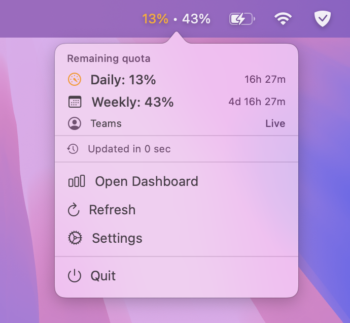

# Windsurf Usage Systray

A lightweight macOS menu bar app that shows your Windsurf quota without opening the editor or a browser.



## What it shows

The app focuses on the Windsurf quota model:

| Metric | Description |
|--------|-------------|
| **Daily** | Remaining daily quota percentage |
| **Weekly** | Remaining weekly quota percentage |
| **Plan** | Current Windsurf plan when available |
| **Source** | Whether the app is showing live or cached data |

Colors update from your configured warning and critical thresholds.

## Requirements

- macOS 13+
- Windsurf installed
- Apple Silicon and Intel Macs are supported
- for live mode: Windsurf should be running

## First launch

The app is not signed with an Apple Developer certificate. On first launch, macOS will show a warning:

> "WindsurfUsageSystray" can't be opened because Apple cannot check it for malicious software.

To allow the app:

1. Open **System Settings → Privacy & Security**
2. Scroll down and click **Open Anyway**
3. Confirm in the dialog

Or remove the quarantine attribute via Terminal:

```bash
xattr -d com.apple.quarantine /Applications/WindsurfUsageSystray.app
```

## How it works

The app uses two local data sources:

1. live data from the running Windsurf language server
2. cached quota data from `~/Library/Application Support/Windsurf/User/globalStorage/state.vscdb`

The app prefers live data when possible and falls back to cached local state when Windsurf is not running or the live request fails.

Windsurf requires a dual-source local-first design because of lack of public API for remaining quota and live quota is best obtained from the authenticated local language server, while cached local state provides a safe fallback.

For live mode discovery, the app supports both macOS Windsurf language server variants:

- `language_server_macos_arm`
- `language_server_macos_x64`

## Display modes

Toggle **Show both quotas** in Settings to switch between:

- **Both quotas (default):** `83% • 77%` (daily • weekly)
- **Daily only:** icon + daily remaining percentage

## Settings

| Setting | Default | Description |
|---------|---------|-------------|
| Prefer live Windsurf data | On | Use the local Windsurf language server first |
| Show source in popover | On | Show whether data is live or cached |
| Show both quotas | On | Show daily and weekly quota in the menu bar |
| Show used instead of remaining | Off | Display used percentage instead of remaining |
| Refresh on popover open | Off | Refresh data when opening the popover |
| Refresh interval | 2 min | How often to refresh quota data |
| Warning threshold | 80% | Orange when weekly used quota crosses this |
| Critical threshold | 90% | Red when weekly used quota crosses this |
| Quota alerts | On | macOS notification when thresholds are crossed |
| Killswitch | Off | Kill Windsurf AI when quota drops to threshold (Live mode only) |

## Build from source

```bash
git clone https://github.com/i-zhirov/windsurf-usage-systray
cd windsurf-usage-systray/windsurf-usage-systray
xcodebuild -project WindsurfUsageSystray.xcodeproj -scheme WindsurfUsageSystray -configuration Release \
  -derivedDataPath /tmp/ws-build-dd build
open ~/Library/Developer/Xcode/DerivedData/WindsurfUsageSystray-*/Build/Products/Release/WindsurfUsageSystray.app
```

Or open `WindsurfUsageSystray.xcodeproj` in Xcode and run with ⌘R.

## Running tests

```bash
xcodebuild test -project WindsurfUsageSystray.xcodeproj \
  -scheme WindsurfUsageSystrayTests \
  -derivedDataPath /tmp/ws-test-dd \
  -destination 'platform=macOS'
```

## License

MIT
